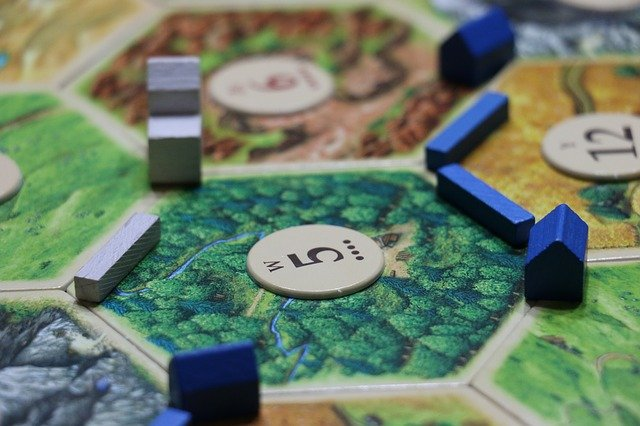

# CodeGames
## Final project for UW PMP Domain Specific Languages Winter 2021


CodeGames is a Typescript library to help make board games in the browser. Use it to define the rules of your game and we'll handle keeping the game state up-to-date.
## [Proposal](https://docs.google.com/document/d/1GV2r5wCsTPgOj_3APRqeA7JzegAeTDoaa3FoW-ncBpg/edit)  
## [Design Document](https://docs.google.com/document/d/17f2Ny1IawnVOAPdgZp6RzV-M-mB4pg23ZUP8Hmj_LJE/edit?usp=sharing)
## [Poster](https://drive.google.com/file/d/1fvimcJ37YoAVz3Cokm352s_m3ailQcdx/view?usp=sharing)

There are two main parts to using CodeGames: defining a game and playing a game.
## Defining a game
<details><summary><b>Show instructions</b></summary>
The first step to using the library is to define the <b>game</b>. A game at minimum needs a <b>name</b>, a number of <b>players</b> and a number of <b>moves</b>. Games can also have <b>phases</b>. Some moves are only availble during  certain phases. For example, there could be one phase where players draw cards and another phase where players play cards from their hand.

Start by defining your game player. If you don't need any special state for your player, you can simply use the provided ````GamePlayer````. However, you will probably want to hold some information, such as number of coins or a hand of cards.
````
class MyPlayer extends GamePlayer {
    constructor() {
        this.coins = 0;
        this.cards = [];
    }
    ...
}
````
Now create some moves. Your move should be a class that extends the provided ````GameMove```` class. There are various lifecycle hooks that you can use, such as ````onTurnStart```` and ````onTurnEnd````. At minimum, you need to define ````onMoveTaken````, which will get called when a player takes this move. Nearly all lifecycle methods you define using the library will be provided a GameContext object as the first argument. The gameContext object contains information such as the current player and any other custom state you set on the game. ````onMoveTaken```` can also taken any number of custom arguments after the context. 

For example, let's say one move is take coins. It starts with one coin and every turn it gains another coin. 
````
class MyMove extends GameMove {
    constructor() {
        super("MyMove"); // give it a name
        this.coins = 1;
    }

    onTurnStart(ctx) {
        this.coins += 1; // add a coin at the beginning of every turn
    }

    onMoveTaken(ctx) {
        let currentPlayer = ctx.getCurrentPlayer();
        currentPlayer.coins += this.coins;
        this.coins = 0;
    }
}
````

Moves are organized into phases. To create a phase, extend the ````GamePhase```` class. Like ````GameMove```` there are various hooks you can define on the phase, such as ````setup````, ````postPhase````, ````onTurnStart```` and ````onTurnEnd````. At minimum you need to define the list of moves available.
````
class MyPhase extends GamePhase {
    constructor() {
        super("MyPhase");
        this.moves = [new MyMove()];
    }

    getMoves() {
        return this.moves;
    }
}
````

We have now covered the main building blocks for a game and we're ready to put everything together:
``` 
Game g = new Game("CodeGames"); // give it a name
g.hasPlayers(2,4) // define the min and max number of players 
```

The game object itself also allows you to define some useful callbacks:
````
g.addSetup((ctx) => ...); // callback called when the game starts
g.endIf(ctx) => ...); // callback called to see if the game should end
g.onGameEnd((ctx) => ...); // callback called when the game ends.
````
</details>

## Playing a game
<details><summary><b>Show instructions</b></summary>
Now that the game is defined, you're ready to play. Create a new <b>GameClient</b>, passing in the name of the game. Add your players and start.

````
GameClient cg = new GameClient("CodeGames");
cg.addPlayer(player1);
cg.addPlayer(player2);
cg.start();
````
At this point, the game is ready to receive moves.

````
let moves = cg.moves; // get a list of moves
cg.makeMove("MyMove"); // make a move. 
// If the move takes parameters, you can pass them in here after the name.
````

The library provides a debug view so you can test out your game before making any UI. In your html file, provide the following markup:

````
    <div id="moves">
        <!-- we will put here a button for each available move. 
        clicking the button will trigger the move -->
    </div>
    <pre id="debug">
        <!-- we will put here the game state -->
    </pre>
````
</details>

## Examples
This repo includes example games in the examples folder. To try them out, first compile the typescript:
````
npm run typescript
````
Then build the game you're interested in.
````
npm run buildNim
npm run buildAgricola
````
Open the index.html file in the examples\\{gamename} folder.